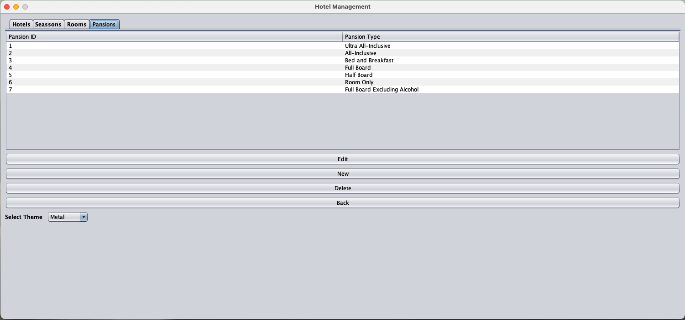

# Patika Tourism Agency Software
Patika Tourism Agency is ready for digital transformation. The Hotels Management System aims to optimize daily operations and expedite reservations with features like user-friendly interface, flexible pricing, and automated calculations, enhancing efficiency and replacing manual tasks.

[](https://github.com/semih-turan)

## Features

- There are two types of users: admin and agency staff.
- User management: Admin can add, delete, update users and assign roles.
- Hotel management: Agency staff can add and edit hotels.
- Room management: Agency staff can add and price rooms.
- Period management: Agency staff can add periods for hotels.
- Price management: Agency staff can set room prices.
- Room search: Agency staff can search for rooms based on desired criteria and make reservations.
- Reservation management: Agency staff can list, add, update, and delete reservations.

## Technical Details

- The project is designed according to SOLID principles and MVC architecture.
- PostgreSQL is used as the database.
- Swing is used for the user interface.
- The project follows a multi-layered architecture.

## Installation

1. Clone the project:
    ```bash
    git clone https://github.com/semih-turan/Tourism-Agency-Management.git
    ```
2. Install PostgreSQL.
3. Create a new database named `toursimAgencyManagemennt` in PostgreSQL.
4. Restore this database using the SQL file located at `SQL/tourismAgencyManagement.sql` and named `tourismAgencyManagement.sql`.
5. Update the PostgreSQL username and password from the file located at `Tourism-Agency-Management/src/Log/DBconfigure.properties`.
6. Compile and run the program with an IDE.

***P.S:*** *Default admin login credentials*
*Username: admin*
*Password: admin*

## Video
[](https://www.youtube.com/watch?v=O9jJBuAfaz4 "Tourism Agency Management Demo Video")


## Screenshots





## Usage

1. Admin logs in and creates the first user.
2. Admin adds agency staff and authorizes them.
3. Agency staff adds hotels and rooms to the system.
4. Agency staff adds periods and sets prices.
5. Agency staff searches for rooms based on customer requests and makes reservations.

## Requirements
- Java JDK 22 or higher
- PostgreSQL Driver Version 42.7.31

## Contributions

- Feel free to provide any feedback to [semituran@gmail.com](mailto:semituran@gmail.com).
- If you want to contribute to the project, you can open a pull request.

## License

This project is licensed under the MIT License. See the [LICENSE](LICENSE) file for details.
